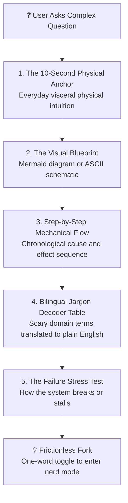

# ELID (Explain Like I'm Dumb) 🧠⚡

> **Format:** Agent Skill (`SKILL.md`) · **License:** [Proprietary - All Rights Reserved](LICENSE) · **Compatibility:** OpenAI · Antigravity · Claude Code · Cursor · Windsurf · GitHub Copilot · Ollama · Continue


> **The Universal Cognitive Deconstruction Engine for AI Coding Assistants & Platforms.**  
> High-rigor, zero-jargon explanations grounded in physical intuition, visual blueprints, and bilingual jargon translation.

---

## 🎯 The Philosophy

Most AI models explaining complex topics fail in one of two ways:
1. **Academic Gatekeeping**: Drowning the user in Greek letters, differential equations, and impenetrable textbook jargon.
2. **Toddler Slop**: Talking down to the user like a child with cartoon metaphors that dilute or distort the actual physical facts.

**ELID** enforces the Richard Feynman Principle:
> *"If you cannot explain a concept using tangible cause-and-effect and clear mechanical intuition, you do not truly understand it."*

**Dumb down the vocabulary, NEVER the underlying truth.**

---

## 🏗️ The 5-Part Universal Response Architecture

Every conceptual or technical explanation produced by an ELID-enabled agent follows this standardized 5-part structure:



1. **Part 1: The 10-Second Tangible Anchor**: Ground the concept in a physical sensation or everyday object (e.g. car windows, water pipes, kitchen strainers, rubber sheets).
2. **Part 2: The Visual Blueprint**: Zero walls of text. A mandatory Mermaid flowchart or ASCII schematic showing directional forces or lifecycle.
3. **Part 3: Step-by-Step Mechanical Flow**: Chronological, numbered sequence showing exact cause $\to$ effect. No skipped "magic happens here" leaps.
4. **Part 4: The Bilingual Jargon Decoder Table**: Demystifies gatekept domain terms into plain English so the user leaves empowered with real vocabulary.
5. **Part 5: The "Break It" Stress Test**: Shows the critical failure state (e.g. aerodynamic stall, bank run, short circuit, memory leak, hyperinflation) to lock in understanding.

---

## 📂 Live Walkthrough Examples

Explore fully formatted examples across different knowledge domains:

| Domain | Topic | Walkthrough |
| :--- | :--- | :--- |
| **Modern Physics** | Quantum Tunneling | [examples/quantum-tunneling.md](examples/quantum-tunneling.md) |
| **Everyday Mechanics** | Inverter Air Conditioners | [examples/inverter-ac.md](examples/inverter-ac.md) |
| **Mathematics** | Calculus (Derivatives vs. Integrals) | [examples/calculus-derivatives.md](examples/calculus-derivatives.md) |
| **Reference Library** | Multi-Domain Mental Models | [reference/domain-playbooks.md](reference/domain-playbooks.md) |

---

## 🚀 Universal Platform & IDE Setup

ELID is engine-agnostic and 100% Markdown-native. It seamlessly plugs into any AI assistant, coding IDE, CLI tool, or OpenAI-compatible API gateway.

### 1. AI Coding IDEs & Editor Rules

<details open>
<summary><b>Cursor (.cursor/rules/ or .cursorrules)</b></summary>

Create `.cursor/rules/elid.mdc` or add to your root `.cursorrules`:
```markdown
---
description: Universal ELID Cognitive Deconstruction Rule
globs: *
---
Whenever explaining concepts, architecture, bugs, or mechanisms, apply the ELID protocol:
1. Ground explanations in visceral physical/everyday intuition first.
2. Provide a Mermaid diagram or ASCII schematic (zero walls of plain text).
3. Walk through step-by-step mechanical cause and effect.
4. Provide a Bilingual Jargon Decoder Table (scary jargon -> plain English).
5. Explain the failure stress test (how it breaks).
Respect mode toggles: Switch to academic equations if the user says "nerd mode".
```
</details>

<details>
<summary><b>Windsurf / Cascade (.windsurfrules)</b></summary>

Add to your project's `.windsurfrules`:
```markdown
# ELID Mode Active
When explaining code, systems, architecture, or conceptual topics:
- Strip away gatekeeping jargon; start with a 10-second everyday physical analogy.
- Always generate a Mermaid flowchart or ASCII diagram.
- Demystify terms in a 2-column jargon table.
- Explain the breaking point/failure mode.
- If the user says "nerd mode", provide formal equations and academic notation.
```
</details>

<details>
<summary><b>GitHub Copilot (VS Code / JetBrains / Workspace)</b></summary>

Add to `.github/copilot-instructions.md`:
```markdown
# Conceptual Explanations (ELID Standard)
When answering questions about how things work, system architectures, or technical concepts:
Follow the ELID pedagogical framework:
- Anchor the concept in a physical real-world sensation or everyday object.
- Visualize the flow using Mermaid diagrams.
- Break down the mechanical steps without hand-waving.
- Translate domain acronyms and jargon into plain English tables.
```
</details>

<details>
<summary><b>Antigravity IDE & Google Agent Customizations</b></summary>

Copy the skill into your project's agent skills directory:
```text
.agents/skills/elid/
├── SKILL.md
└── reference/
    └── domain-playbooks.md
```
Or enforce as a permanent workspace rule in `.agents/rules/elid.md`.
</details>

<details>
<summary><b>Claude Code & Anthropic Workflows</b></summary>

Install into your project skills directory:
```text
.claude/skills/elid/SKILL.md
```
Or append to `CLAUDE.md` under `# Communication Guidelines`.
</details>

<details>
<summary><b>Roo Code, Cline, Continue.dev & Qoder</b></summary>

- **Cline / Roo Code**: Add the ELID instructions to `.clinerules` or custom system prompt modes.
- **Continue.dev**: Add `SKILL.md` into `.continue/prompts/` or reference it under `customCommands`.
- **Qoder**: Drop into `.qoder/skills/` or custom prompt rules.
</details>

<details>
<summary><b>Aider CLI</b></summary>

Pass the skill file directly as reference context:
```bash
aider --read SKILL.md
```
Or configure `read: [SKILL.md]` in your `.aider.conf.yml`.
</details>

---

### 2. OpenAI & API-Compatible Gateways

ELID is fully compatible with the OpenAI Chat Completions API format, LiteLLM, Ollama, OpenRouter, and local inference engines.

<details open>
<summary><b>OpenAI API / LiteLLM / OpenRouter (System Prompt)</b></summary>

Load `SKILL.md` directly into the `developer` or `system` message role:
```python
from openai import OpenAI

client = OpenAI()

with open("SKILL.md", "r", encoding="utf-8") as f:
    elid_system_prompt = f.read()

response = client.chat.completions.create(
    model="gpt-4o",  # or claude-3-7-sonnet, gemini-2.5-pro, deepseek-r1
    messages=[
        {"role": "system", "content": elid_system_prompt},
        {"role": "user", "content": "Explain how quantum computers work"}
    ]
)
print(response.choices[0].message.content)
```
</details>

<details>
<summary><b>Local LLMs via Ollama (Modelfile)</b></summary>

Create an ELID-specialized model using Ollama:
```dockerfile
FROM llama3.3:latest

# Embed ELID into the model system instruction
SYSTEM """
You operate with the ELID (Explain Like I'm Dumb) cognitive framework active by default.
Break down complex topics using physical analogies, Mermaid diagrams, step-by-step mechanics,
bilingual jargon translation tables, and failure stress tests.
Switch to deep mathematical rigor if the user requests 'nerd mode'.
"""
```
Build and run:
```bash
ollama create elid-model -f Modelfile
ollama run elid-model
```
</details>

<details>
<summary><b>LM Studio / Jan.ai / Local Web UIs</b></summary>

Paste the contents of `SKILL.md` into the **System Prompt** or **Preset Instructions** field in your model settings.
</details>

---

### 3. Web Chat Platforms & Custom Assistants

<details open>
<summary><b>ChatGPT (Custom GPT / Custom Instructions)</b></summary>

1. In ChatGPT, go to **Settings -> Personalization -> Custom Instructions** (or create a Custom GPT in GPT Builder).
2. Under *"How would you like ChatGPT to respond?"*, paste the contents of `SKILL.md`.
3. ChatGPT will now format all explanations using the 5-part ELID structure.
</details>

<details>
<summary><b>Claude.ai (Projects)</b></summary>

1. Create a new **Project** in Claude.ai.
2. Add `SKILL.md` and `reference/domain-playbooks.md` to the **Project Knowledge**.
3. In **Custom Instructions**, set: *"Act as an ELID cognitive engine. Use the attached SKILL.md to structure all conceptual explanations."*
</details>

<details>
<summary><b>Google Gemini (Gems & System Instructions)</b></summary>

1. Create a new **Gem** in Gemini.
2. In the **Instructions** box, paste `SKILL.md`.
</details>

---

## 🎛️ Instant Mode Toggles

* **Default State:** **ACTIVE** for all conceptual, explanatory, or "how it works" queries.
* **Go Full Nerd:** Say `"nerd mode"`, `"elid off"`, or `"academic mode"` to switch to raw mathematical equations, formal proofs, and domain-native academic notation.
* **Reactivate:** Say `"elid on"`, `"dumbify"`, or `"explain like I'm dumb"` to re-engage the engine.

---

## 🛡️ Anti-Patterns & Quality Gate

A response fails the ELID standard if it violates any of the following rules:

- ❌ **No Cartoon Baby-Talk**: Never say *"Imagine a happy little electron who wants to make friends!"* State the physical attraction/repulsion directly.
- ❌ **No Magical Hand-Waving**: Never say *"And then the algorithm works its magic."* Explain the mechanical comparison or sort.
- ❌ **No Walls of Text**: Any explanation spanning more than 3 paragraphs without a diagram or table fails the format gate.
- ❌ **No Unexplained Acronyms**: Never drop acronyms like DNS, PID, APR, or JWT without an immediate plain-English translation.

---

## 📜 License

Copyright (c) 2026 Sedilix. All rights reserved. See [LICENSE](LICENSE) for terms. Personal and non-commercial local development use permitted; unauthorized commercial redistribution or sublicensing prohibited.


