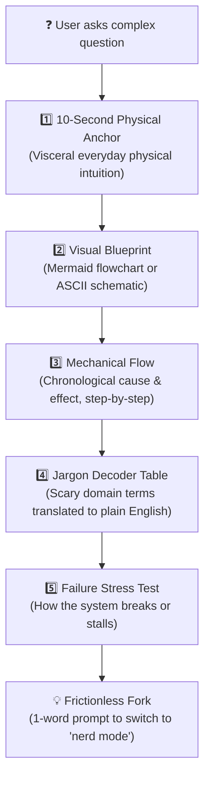

# ELID (Explain Like I'm Dumb) 🧠⚡

> **Format:** Agent Skill (`SKILL.md`) · **License:** [MIT](LICENSE) · **Compatibility:** Antigravity · Claude Code · Cursor · Windsurf · Qoder


> **The Universal Cognitive Deconstruction Engine for AI Coding Assistants & Platforms.**  
> High-rigor, zero-jargon explanations grounded in physical intuition, visual blueprints, and bilingual jargon translation.

---

## 🎯 The Philosophy

Most AI models explaining complex topics fail in one of two ways:
1. **Academic Gatekeeping**: Drowning the user in Greek letters, differential equations, and impenetrable textbook jargon.
2. **Toddler Slop**: Talking down to the user like a child with cartoon metaphors that dilute or distort the actual physical facts.

**ELID** enforces the Richard Feynman Principle:
> *"If you cannot explain a concept using tangible cause-and-effect and clear mechanical intuition, you do not truly understand it."*

**Dumb down the vocabulary, NEVER the underlying truth.**

---

## 🏗️ The 5-Part Universal Response Architecture

Every conceptual or technical explanation produced by an ELID-enabled agent follows this standardized 5-part structure:



1. **Part 1: The 10-Second Tangible Anchor**: Ground the concept in a physical sensation or everyday object (e.g. car windows, water pipes, kitchen strainers, rubber sheets).
2. **Part 2: The Visual Blueprint**: Zero walls of text. A mandatory Mermaid flowchart or ASCII schematic showing directional forces or lifecycle.
3. **Part 3: Step-by-Step Mechanical Flow**: Chronological, numbered sequence showing exact cause $\to$ effect. No skipped "magic happens here" leaps.
4. **Part 4: The Bilingual Jargon Decoder Table**: Demystifies gatekept domain terms into plain English so the user leaves empowered with real vocabulary.
5. **Part 5: The "Break It" Stress Test**: Shows the critical failure state (e.g. aerodynamic stall, bank run, short circuit, memory leak, hyperinflation) to lock in understanding.

---

## 📂 Live Walkthrough Examples

Explore fully formatted examples across different knowledge domains:

| Domain | Topic | Walkthrough |
| :--- | :--- | :--- |
| **Modern Physics** | Quantum Tunneling | [examples/quantum-tunneling.md](examples/quantum-tunneling.md) |
| **Everyday Mechanics** | Inverter Air Conditioners | [examples/inverter-ac.md](examples/inverter-ac.md) |
| **Mathematics** | Calculus (Derivatives vs. Integrals) | [examples/calculus-derivatives.md](examples/calculus-derivatives.md) |
| **Reference Library** | Multi-Domain Mental Models | [reference/domain-playbooks.md](reference/domain-playbooks.md) |

---

## 🚀 Installation & Agent Setup

### 1. Antigravity IDE / Agent Customizations
Copy the `elid` directory into your project's agent skills folder:
```bash
# In your workspace root:
mkdir -p .agents/skills/elid
cp SKILL.md .agents/skills/elid/
```

### 2. Claude Code
Install into your `.claude/skills/` directory:
```bash
mkdir -p .claude/skills/elid
cp SKILL.md .claude/skills/elid/
```

### 3. Cursor & Windsurf
Add the following directive into your project rules (e.g. `.cursor/rules/elid.mdc` or `.windsurfrules`):
```markdown
Whenever explaining concepts, architecture, or mechanisms, apply the ELID skill from SKILL.md.
Ground explanations in physical intuition, provide Mermaid/ASCII diagrams, decode jargon,
and avoid both academic gatekeeping and baby-talk condescension.
```

### 4. ChatGPT / Claude.ai / Custom System Prompts
Copy the contents of [SKILL.md](SKILL.md) directly into your Custom Instructions or System Prompt.

---

## 🎛️ Instant Mode Toggles

* **Default State:** **ACTIVE** for all conceptual, explanatory, or "how it works" queries.
* **Go Full Nerd:** Say `"nerd mode"`, `"elid off"`, or `"academic mode"` to switch to raw mathematical equations, formal proofs, and domain-native academic notation.
* **Reactivate:** Say `"elid on"`, `"dumbify"`, or `"explain like I'm dumb"` to re-engage the engine.

---

## 🛡️ Anti-Patterns & Quality Gate

A response fails the ELID standard if it violates any of the following rules:

- ❌ **No Cartoon Baby-Talk**: Never say *"Imagine a happy little electron who wants to make friends!"* State the physical attraction/repulsion directly.
- ❌ **No Magical Hand-Waving**: Never say *"And then the algorithm works its magic."* Explain the mechanical comparison or sort.
- ❌ **No Walls of Text**: Any explanation spanning more than 3 paragraphs without a diagram or table fails the format gate.
- ❌ **No Unexplained Acronyms**: Never drop acronyms like DNS, PID, APR, or JWT without an immediate plain-English translation.

---

## 📜 License

Released under the [MIT License](LICENSE). Free for personal, educational, and commercial use.
