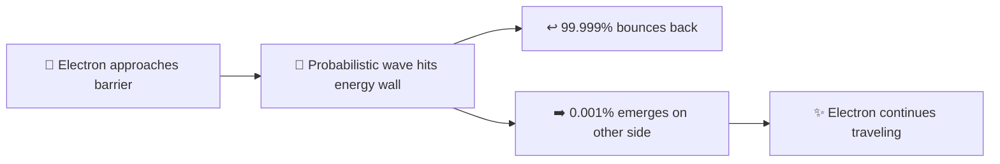

# ELID Example: Quantum Tunneling

> **User Prompt:** "Explain quantum tunneling."

---

### 1. The 10-Second Physical Anchor
Imagine throwing a tennis ball at a thick concrete wall. In everyday life, the ball bounces off 100% of the time. But in the subatomic quantum world, particles are not hard billiard balls—they are fuzzy, vibrating ripples of probability. Because their edges are blurry, there is a tiny chance that the particle's ripple extends slightly through to the other side of the wall. Throw that particle 10 million times, and once, it simply pops out on the other side without breaking the concrete.

---

### 2. The Visual Blueprint



```
Energy Barrier (Wall)
      |   |
~ ~ ~ | : | ~ ~ ~ (Tiny wave continues!)
      |   |
```

---

### 3. Step-by-Step Mechanical Flow
1. **The Approach:** A subatomic particle (like an electron) flies toward an electric or energy barrier that is technically too tall for it to climb over.
2. **The Wave Spread:** Quantum mechanics dictates that until you measure the particle, its exact location is a spread-out wave packet (Schrodinger wavefunction).
3. **The Penetration:** When the wave strikes the barrier, it decays exponentially inside the wall, but does not immediately drop to zero.
4. **The Exit:** If the barrier is thin enough (nanometers wide), a fraction of the wave leaks out the other side. That fraction represents the real physical probability of the electron appearing on the opposite side.

---

### 4. Bilingual Jargon Decoder Table

| Scary Jargon | Plain-English Meaning | Real-World Translation |
| :--- | :--- | :--- |
| **Wavefunction ($\psi$)** | The ripple of probability. | The mathematical map of where the particle might be at any moment. |
| **Potential Barrier** | The force field / wall. | A hill too steep for a ball to roll over using normal momentum. |
| **Evanescent Wave** | The leaking ripple inside the barrier. | The vibrating sound waves penetrating through a thick hotel room wall. |

---

### 5. The "Break It" Stress Test (Failure Mode)
* **What breaks it?** If the wall gets even slightly thicker (e.g., from 1 nanometer to 10 nanometers), the tunneling probability drops to essentially zero. Quantum tunneling only works at atomic scales; you will never walk through a bedroom door because your body's mass and the door's thickness make the odds $1 \text{ in } 10^{35}$ lifetimes of the universe.
* **Where we use it every day:** Your USB thumb drives (flash memory) and SSDs literally use quantum tunneling to shove electrons through insulated gates to save your files!

---
*💡 Need the formal mathematical proofs, Hamiltonian matrices, or Schrodinger differential equations? Just say **"nerd mode"**.*
